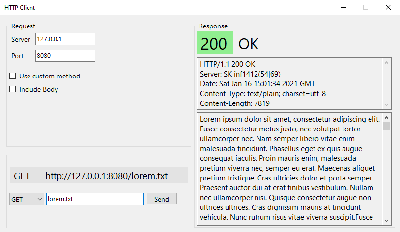

# http-client

Simple http client with GUI for Windows written in .NET for testing my [http-server](https://github.com/mackowiakw/http-server).

- You can use either custom method or predefined GET, HEAD, PUT or DELETE.

- You can attach message (body) to the request (excepting GET and HEAD methods).
 
- Headers are only displayed and then ignored.

- Recived content is not rendered like browers do. It is only displayed as raw text.

- Works also with Internet Web Servers (at port 80)
## Usage:

Clone:
```
git clone https://github.com/mackowiakw/http-client.git

cd http-client
```

Build and launch ([.NET SDK](https://dotnet.microsoft.com/download) required):
```
dotnet build -o .\output --configuration Release

.\output\http-client.exe
```


## Preview:

